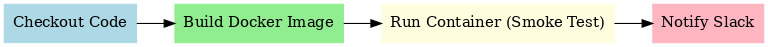

# 🚀 Jenkins CI/CD Pipeline with Docker & Slack Integration

This project demonstrates a **CI/CD pipeline** using **Jenkins**,
integrated with **GitHub webhooks**, **Docker**, and **Slack
notifications**.

## 📂 Project Overview

- **App**: Simple Node.js Express app with `/health` endpoint.
- **Pipeline**: Defined in `Jenkinsfile`.
- **Build Agent**: Jenkins running on EC2 with Docker installed.
- **CI/CD Flow**:
  1.  GitHub push triggers Jenkins build (via webhook).
  2.  Jenkins checks out the repo.
  3.  Builds Docker image from `Dockerfile`.
  4.  Runs container and performs health check.
  5.  Sends success/failure notification to Slack.

---

## Repository Layout

```
Jenkins-Work/
└── Jenkins/
    ├── Dockerfile
    ├── app.js
    ├── package.json
    └── Jenkinsfile        # The pipeline used by Jenkins
```

---

## Jenkinsfile (for reference)

```groovy
pipeline {
  agent any
  options { skipDefaultCheckout(true) }

  environment {
    IMAGE = "jenkins-express:${env.BUILD_NUMBER}"
    DOCKER_BUILDKIT = "1"
  }

  stages {
    stage('Checkout') {
      steps { checkout scm }
    }

    stage('Build Image') {
      steps {
        dir('Jenkins-Work/Jenkins') {
          sh 'docker build -t $IMAGE .'
        }
      }
    }

    stage('Run Container (smoke test)') {
      steps {
        sh '''
          docker rm -f jx || true
          docker run -d --name jx -p 3000:3000 $IMAGE
          sleep 3
          curl -fsS http://localhost:3000/health
        '''
      }
    }
  }

  post {
    success {
      slackSend channel: '#all-gerard-eklu-the-dev',
                color: 'good',
                message: "SUCCESS: Build #${env.BUILD_NUMBER} for ${env.JOB_NAME}"
    }
    failure {
      slackSend channel: '#all-gerard-eklu-the-dev',
                color: 'danger',
                message: "FAILED: Build #${env.BUILD_NUMBER} for ${env.JOB_NAME}"
    }
    always {
      sh '''
        docker rm -f jx || true
        docker image prune -f || true
      '''
    }
  }
}
```

---

## ⚙️ Jenkinsfile Stages

- **Checkout** → Pulls code from GitHub.
- **Build Image** → Builds Docker image using `docker build`.
- **Run Container (Smoke Test)** → Runs container, tests `/health`
  endpoint.
- **Post Actions** → Sends Slack notification & cleans up Docker.

---

## 📦 Tools Used

- **Jenkins**
- **GitHub**
- **Docker**
- **Slack**

---

## 🔗 Pipeline Diagram



## ✅ Example Slack Notifications

- ✅ SUCCESS: Build #12 for jenkins-express
- ❌ FAILED: Build #13 for jenkins-express

---

## Jenkins Setup (quick recap)

- **Credentials**
  - SSH key (ID: `git`) for GitHub clone (user `git`, private key pasted).
  - Slack token as a **Secret text** credential (ID: `slack-token`) or incoming webhook as **Secret text**.
- **Global Config → Slack**
  - Workspace: `gerard-eklu-the-dev`
  - Credential: your Slack credential
  - Test connection should succeed
- **Job Configuration**
  - Pipeline definition: _Pipeline script from SCM_
  - SCM: Git (SSH) → `git@github.com:gerardinhoo/Devops-Journey.git`
  - Script Path: `Jenkins-Work/Jenkins/Jenkinsfile`

---

## GitHub Webhook

Set payload URL to:  
`http://<ec2-elastic-ip>:8080/github-webhook/`  
Events: _Just the push event_ (and/or PRs if needed).

---

## Notes

- Jenkins is running on EC2 with Docker available to the `jenkins` user.
- Slack notifications require the Slack plugin and a valid token/webhook.

---

### Author

👨‍💻 Gerard Eklu --- _DevOps Journey_
