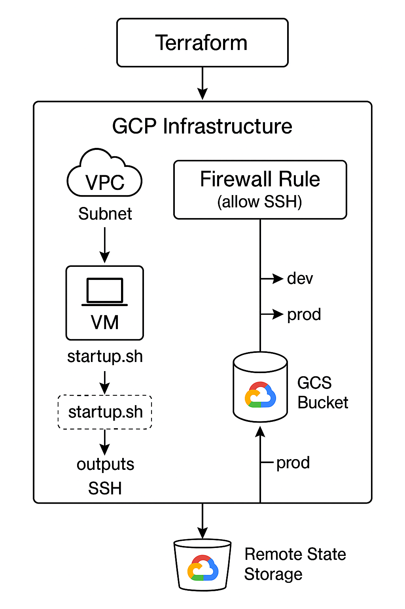
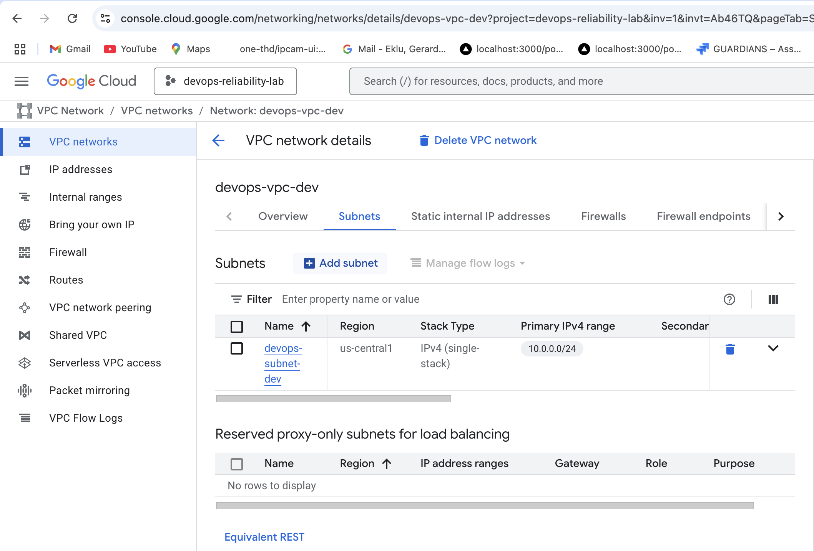
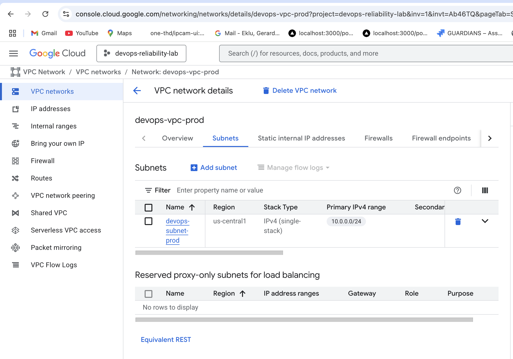
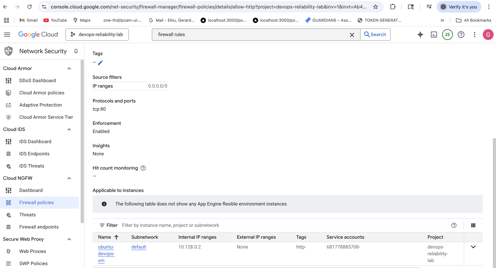
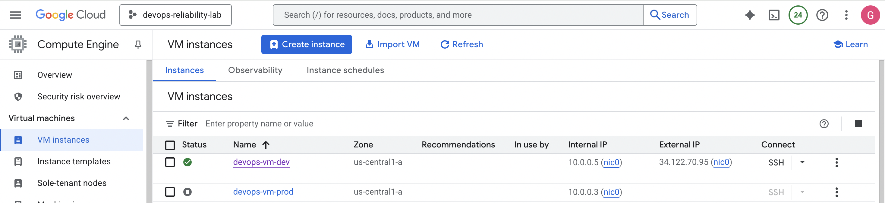
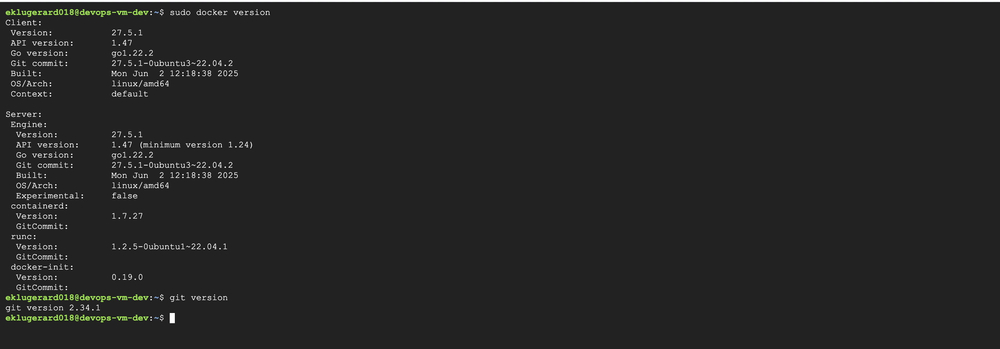

# 🚀 GCP Infrastructure Setup with Terraform

This project provisions and manages a complete infrastructure on **Google Cloud Platform** using **Terraform**, following real-world DevOps practices.

---

## ✅ What’s Been Done So Far

### 1. 📊 Architecture Diagram

A high-level view of the infrastructure provisioning using Terraform and GCP:



---

### 2. 🔧 Terraform Files Created

#### Development Environment

- **gcp-terraform-dev/main.tf**: Core infrastructure setup (VPC, Subnet, Firewall, VM)
- **gcp-terraform-dev/variables.tf**: Input variables for flexibility and reuse
- **gcp-terraform-dev/terraform.tfvars**: Concrete values for the defined variables
- **gcp-terraform-dev/startup.sh**: Provisioning script to install Docker (or any other app) during VM startup
- **gcp-terraform-dev/outputs.tf**: Outputs to extract and display useful runtime data

#### Production Environment

- **gcp-terraform-prod/main.tf**: Core infrastructure setup (VPC, Subnet, Firewall, VM)
- **gcp-terraform-prod/variables.tf**: Input variables for flexibility and reuse
- **gcp-terraform-prod/terraform.tfvars**: Concrete values for the defined variables
- **gcp-terraform-prod/startup.sh**: Provisioning script to install Docker (or any other app) during VM startup
- **gcp-terraform-prod/outputs.tf**: Outputs to extract and display useful runtime data

---

### 3. 🌐 Infrastructure Provisioned on GCP

#### ✅ VPC and Subnet - Dev And Prod Environments

##### Dev Environment

Created a custom VPC and subnet with defined IP ranges.



---

##### Prod Environment



---

#### ✅ Firewall Rule

Allowing inbound HTTP and SSH access via TCP 80 and 22.



---

#### ✅ VM Instances for Dev & Prod Workspaces

Terraform workspaces were used to deploy two separate VM instances.



---

### 4. 🖥️ SSH Verification & Software Installation

- Connected to VM via `gcloud compute ssh`
- Verified Docker and Git installed using startup script



---

### 5. 🌱 Terraform Workspaces: `dev` and `prod`

Resources were dynamically named and isolated per environment:

| Feature               | Benefit                                         |
| --------------------- | ----------------------------------------------- |
| Environment isolation | Separate `dev` and `prod` resources             |
| Dynamic naming        | `-dev` and `-prod` suffixes added automatically |
| GCS remote backend    | Each workspace has isolated tfstate in GCS      |

> Example:

- `devops-vm-dev`, `devops-vpc-dev`, `devops-subnet-dev`
- `devops-vm-prod`, `devops-vpc-prod`, `devops-subnet-prod`

---

### 6. ✅ Outputs Used

- External IPs, VM names, and other identifiers used for debugging and CI/CD

---

## 7. 📁 Project Structure

```plaintext
GCP-TERRAFORM-INFRA/
├── assets/
│   └── architecture-diagram.png
├── gcp-terraform-dev/
│   ├── backend.tf
│   ├── main.tf
│   ├── outputs.tf
│   ├── startup.sh
│   ├── terraform.tfvars
│   └── variables.tf
├── gcp-terraform-prod/
│   ├── backend.tf
│   ├── main.tf
│   ├── outputs.tf
│   ├── startup.sh
│   ├── terraform.tfvars
│   └── variables.tf
├── README.md
└── .terraform.lock.hcl


## 🏁 Next Steps

- [x] Remote backend in GCS configured
- [x] Terraform workspaces (dev/prod) setup
- [ ] Monitoring via Stackdriver or Prometheus (GCP infra)
- [ ] CI/CD with GitHub Actions for Terraform
- [ ] Reusable modules refactor
- [ ] Secrets management via Vault or GCP Secrets Manager

---

```
