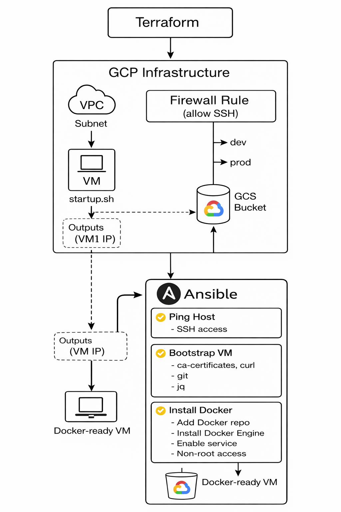
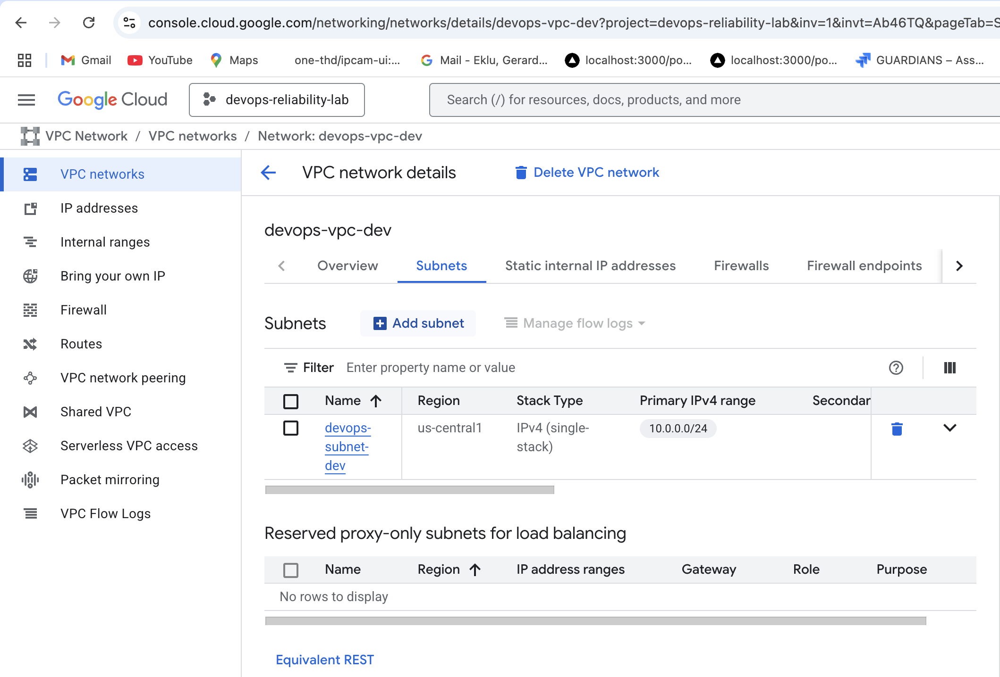
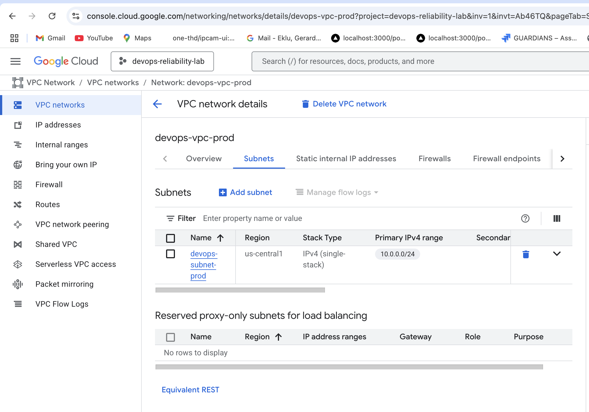
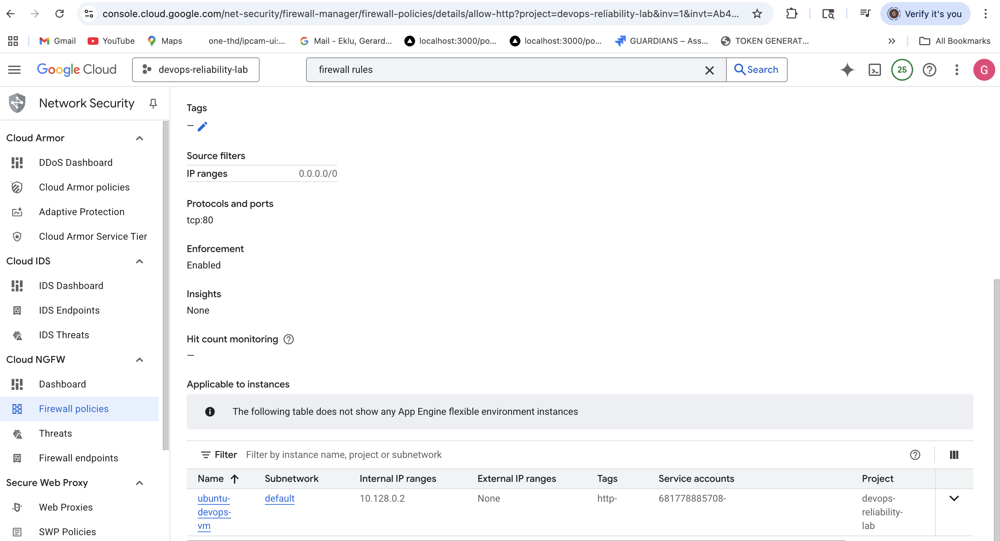
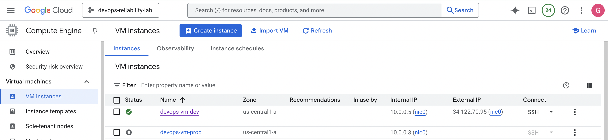

# GCP Infrastructure Automation (Terraform + Ansible)


---

Provisioned a full GCP environment with Terraform — VPC, subnets, firewall rules, and Compute Engine instances. GCS remote state with Terraform workspaces for dev/prod isolation. Ansible handles post-provision configuration: OS bootstrapping, package installation, and Docker runtime setup. End-to-end infrastructure lifecycle automation from provisioning to runtime readiness.

---

## Architecture



---

## What This Provisions

**Networking**
- Custom VPC with defined CIDR ranges
- Subnets for dev and prod environments
- Firewall rules allowing HTTP (80) and SSH (22) ingress

**Compute**
- Compute Engine VM instances per environment
- Startup script for initial Docker/Git installation
- Outputs for external IPs and VM identifiers

**State Management**
- GCS remote backend for Terraform state
- Workspace isolation — `dev` and `prod` maintain separate state files
- Dynamic resource naming with environment suffixes (`-dev`, `-prod`)

**Configuration Management (Ansible)**
- `ping.yml` — Validates SSH connectivity and Python availability
- `bootstrap.yml` — Updates apt cache, installs baseline packages (curl, git, htop, jq)
- `docker.yml` — Adds Docker’s GPG key and apt repo, installs Docker Engine, enables the service, adds user to docker group

Terraform provisions the infrastructure. Ansible configures the OS. This separation ensures infrastructure can be reprovisioned without losing configuration logic, and configuration can be re-applied without touching infrastructure.

---

## Screenshots

### VPC + Subnet (Dev)


### VPC + Subnet (Prod)


### Firewall Rules


### VM Instances (Dev + Prod Workspaces)


---

## Project Structure

```
gcp-terraform-infra/
├── assets/
│   └── architecture_diagram.png
├── ansible/
│   ├── ansible.cfg
│   ├── inventories/
│   │   ├── dev/hosts.ini
│   │   └── prod/hosts.ini
│   └── playbooks/
│       ├── ping.yml          # Connectivity validation
│       ├── bootstrap.yml     # OS packages (curl, git, htop, jq)
│       └── docker.yml        # Docker Engine installation + config
├── environments/
│   ├── dev/
│   │   ├── backend.tf
│   │   ├── main.tf
│   │   ├── variables.tf
│   │   ├── terraform.tfvars.example
│   │   └── outputs.tf
│   └── prod/
│       ├── backend.tf
│       ├── main.tf
│       ├── variables.tf
│       ├── terraform.tfvars.example
│       └── outputs.tf
└── README.md
```

---

## Usage

### 1. Provision infrastructure

```bash
cd environments/dev
cp terraform.tfvars.example terraform.tfvars
terraform init
terraform workspace select dev  # or: terraform workspace new dev
terraform plan
terraform apply
```

### 2. Configure hosts with Ansible

```bash
cd ansible
ansible-playbook playbooks/ping.yml        # Validate connectivity
ansible-playbook playbooks/bootstrap.yml   # Install base packages
ansible-playbook playbooks/docker.yml      # Install Docker
```

---

## Key Design Decisions

**Terraform workspaces for env isolation** — Same codebase provisions dev and prod. Resources are dynamically named (`devops-vm-dev`, `devops-vpc-prod`) and state files are isolated in GCS.

**No committed environment secrets** — Example `terraform.tfvars` files are provided, but live environment values stay local and are not committed to the repository.

**Ansible for configuration, not provisioning** — Terraform creates infrastructure; Ansible configures it. This separation means you can re-provision a VM without losing playbook logic, and re-run playbooks without touching infrastructure.

**Idempotent playbooks** — All Ansible tasks use modules (`apt`, `service`, `user`) that are safe to run multiple times. Apt lock handling prevents failures during concurrent package operations.

---

## Technologies

- **Terraform** — Infrastructure as Code
- **GCP** — VPC, Subnets, Firewall Rules, Compute Engine, GCS
- **Ansible** — Configuration Management

---

**Author:** [Gerard Eklu](https://github.com/gerardinhoo)
