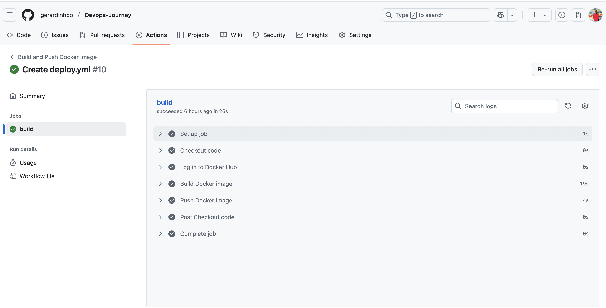

# 🚀 Simple Node API (Dockerized)

This is a simple Express-based Node.js API that responds with a welcome message. It's fully containerized using Docker and deployed to a live Ubuntu EC2 instance using GitHub Actions + SSH deployment. This project is part of my DevOps Journey to practice infrastructure setup, containerization, and CI/CD workflows.

---

## 🔥 Live API Endpoint

**GET /**

### Response:

🚀 Hello from Gerard's Simple Node API!

---

## 🛠 Tech Stack

- Node.js + Express.js
- Docker (image hosted on Docker Hub)
- GitHub Actions (CI/CD)
- EC2 (Ubuntu)
- SSH Deployment
- Security Groups
- GCP alternative setup (WIP)

---

## 📸 Screenshots

### ✅ Live public API from EC2


### ✅ GitHub Actions: CI/CD Workflow



---

## 📁 Project Structure

simple-node-api/
├── Dockerfile
├── package.json
├── index.js
└── README.md

---

## 🐳 Dockerfile Overview

```Dockerfile
FROM node:18
WORKDIR /app
COPY package*.json ./
RUN npm install
COPY . .
EXPOSE 8080
CMD ["npm", "start"]

---

🧪 Run Locally (Dev)

# Clone the repo
git clone https://github.com/gerardinhoo/simple-node-api.git
cd simple-node-api

# Build image
docker build -t simple-node-api .

# Run container
docker run -p 3000:8080 simple-node-api
Then visit: http://localhost:3000

---

🌍 Deploy to EC2 (Manually)

# SSH into EC2 instance
ssh -i ~/.ssh/your-key.pem ubuntu@<your-ec2-public-ip>

# Pull image
docker pull gerardinhoo/simple-node-api

# Run container
docker run -d -p 80:8080 --name simple-node-api gerardinhoo/simple-node-api
Make sure port 80 is allowed in EC2 security group.

---

⚙️ CI/CD with GitHub Actions (SSH Deployment)

# .github/workflows/deploy.yml

name: Deploy to EC2 via SSH

on:
  push:
    branches:
      - main

jobs:
  deploy:
    runs-on: ubuntu-latest

    steps:
      - name: Checkout code
        uses: actions/checkout@v3

      - name: Set up SSH
        uses: webfactory/ssh-agent@v0.7.0
        with:
          ssh-private-key: ${{ secrets.EC2_SSH_KEY }}

      - name: Deploy to EC2
        run: |
          ssh -o StrictHostKeyChecking=no ubuntu@<your-ec2-public-ip> << 'EOF'
            cd ~/Devops-Journey/simple-node-api
            git pull origin main
            docker stop simple-node-api || true
            docker rm simple-node-api || true
            docker rmi gerardinhoo/simple-node-api || true
            docker pull gerardinhoo/simple-node-api
            docker run -d -p 80:8080 --name simple-node-api gerardinhoo/simple-node-api
          EOF

---

🧠 What I Learned
How to Dockerize a Node.js API

How to push Docker images to Docker Hub

How to deploy apps on EC2 with SSH

How to configure GitHub Actions for CI/CD

GCP firewall + VM setup (WIP)

How to expose services on a public IP

---


✅ Next Steps
 Add monitoring with Prometheus + Grafana

 Auto-deploy to GCP via Terraform

 Add a /healthz endpoint and health check in CI/CD

 Deploy to Kubernetes (GKE)


```
