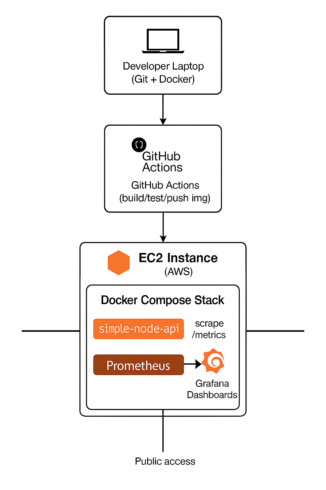
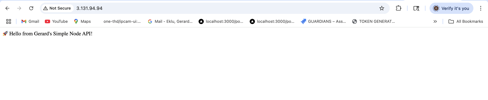
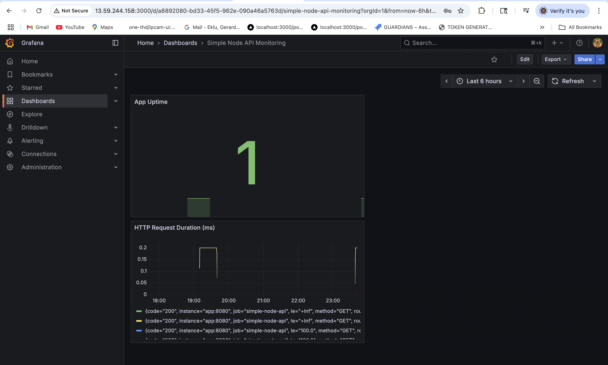
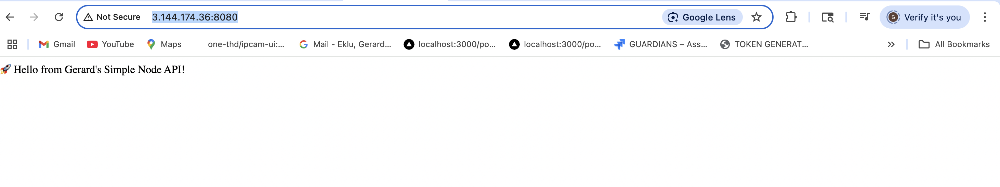
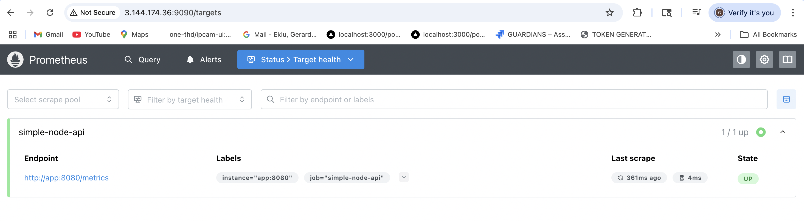

# 🚀 Simple Node API (Dockerized)

This project showcases a fully Dockerized Node.js API deployed via **GitHub Actions** to an **AWS EC2 instance**, with **Prometheus + Grafana** monitoring enabled.

It’s part of my **DevOps Journey** to practice:

- CI/CD pipelines with GitHub Actions
- Containerization with Docker
- SSH-based deployments to EC2
- App monitoring and observability

---

## 📐 Architecture Overview

Here’s a visual of the end-to-end setup:



---

### 🔥 Live API Endpoint

**GET /**

#### Response:

🚀 Hello from Gerard's Simple Node API!

---

### 🛠 Tech Stack

- Node.js + Express.js
- Docker (image hosted on Docker Hub)
- GitHub Actions (CI/CD)
- EC2 (Ubuntu)
- SSH Deployment
- Security Groups
- GCP alternative setup (WIP)

---

### 📸 Screenshots

#### ✅ Live public API from EC2



#### ✅ GitHub Actions: CI/CD Workflow


---

### 📁 Project Structure

simple-node-api/
├── Dockerfile
├── package.json
├── index.js
└── README.md

---

### 🐳 Dockerfile Overview

```Dockerfile
FROM node:18
WORKDIR /app
COPY package*.json ./
RUN npm install
COPY . .
EXPOSE 8080
CMD ["npm", "start"]

```

---

### 🛠 Run Locally (Dev)

## Clone the repo

- git clone https://github.com/gerardinhoo/simple-node-api.git
- cd simple-node-api

## Build Docker image

- docker build -t simple-node-api .

## Run the container

- docker run -p 3000:8080 simple-node-api

## Visit:

- http://localhost:3000

---

### 🌍 Deploy to EC2 (Manually)

## SSH into EC2 instance

- ssh -i ~/.ssh/your-key.pem ubuntu@<your-ec2-public-ip>

## Pull image

- docker pull gerardinhoo/simple-node-api

## Run container

- docker run -d -p 80:8080 --name simple-node-api gerardinhoo/simple-node-api
- Make sure port 80 is allowed in EC2 security group.

---

⚙️ CI/CD with GitHub Actions (SSH Deployment)

## .github/workflows/deploy.yml

name: Deploy to EC2 via SSH

on:
push:
branches: - main

jobs:
deploy:
runs-on: ubuntu-latest

    steps:
      - name: Checkout code
        uses: actions/checkout@v3

      - name: Set up SSH
        uses: webfactory/ssh-agent@v0.7.0
        with:
          ssh-private-key: ${{ secrets.EC2_SSH_KEY }}

      - name: Deploy to EC2
        run: |
          ssh -o StrictHostKeyChecking=no ubuntu@<your-ec2-public-ip> << 'EOF'
            cd ~/Devops-Journey/simple-node-api
            git pull origin main
            docker stop simple-node-api || true
            docker rm simple-node-api || true
            docker rmi gerardinhoo/simple-node-api || true
            docker pull gerardinhoo/simple-node-api
            docker run -d -p 80:8080 --name simple-node-api gerardinhoo/simple-node-api
          EOF

---

---

### 📈 Monitoring with Prometheus + Grafana

This project includes a production-grade monitoring setup for the Simple Node API using:

- 🟣 **Prometheus** to scrape custom metrics from `/metrics`
- 📊 **Grafana** to visualize performance and uptime
- 🐳 **Docker Compose** to orchestrate the app, Prometheus, and Grafana

### 📊 Metrics Monitored

| Panel                          | Description                                                        |
| ------------------------------ | ------------------------------------------------------------------ |
| **HTTP Request Duration (ms)** | Visualizes API response latency using Prometheus histogram buckets |
| **App Uptime**                 | Real-time status (1 = up, 0 = down) scraped from the app           |

### 🖼️ Sample Screenshots

| Dashboard                            | App                      | Prometheus                                             |
| ------------------------------------ | ------------------------ | ------------------------------------------------------ |
|  |  |  |

#### 📂 Dashboard JSON

To reuse or import the Grafana dashboard:

- [`monitoring-dashboard.json`](./monitoring-dashboard.json)

---

### ✅ Run the Monitoring Stack

```bash
# Start app, Prometheus, and Grafana
docker-compose up -d

- Node.js App → http://localhost:8080

- Prometheus → http://localhost:9090

- Grafana → http://localhost:3000

- Default login: admin / admin

```

---

### 🧠 What I Learned

- How to Dockerize a Node.js API

- How to push Docker images to Docker Hub

- How to deploy apps on EC2 with SSH

- How to configure GitHub Actions for CI/CD

- How to set up a full monitoring stack with Prometheus + Grafana

- How to expose metrics from a Node.js app using prom-client

- How to expose services on a public IP

- GCP firewall + VM setup (WIP)

---

### ✅ Next Steps

- Auto-deploy to GCP via Terraform

- Add a /healthz endpoint and health check in CI/CD

- Deploy to Kubernetes (GKE)

- Add alerts in Grafana or Prometheus

- Add system resource monitoring (CPU, memory, event loop lag)

---
